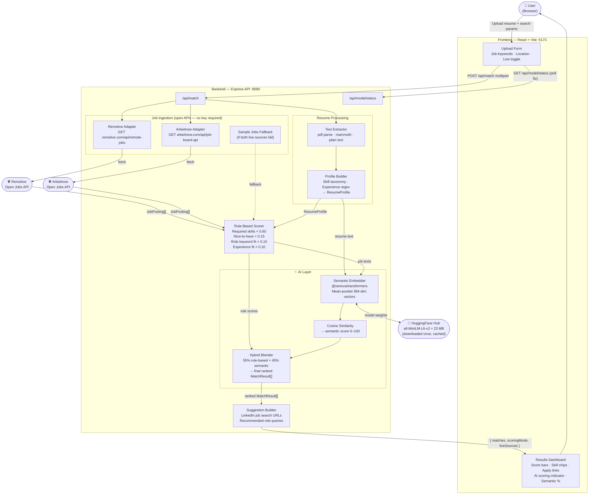

# AI Resume Analyzer + Job Matcher

Upload a resume (PDF, DOCX, TXT) and instantly see how well it matches real-world job listings — with skill-gap analysis, explainable scoring, and direct LinkedIn / apply links.

No sign-up. No API key. Fully open-source.

---

## What This Tool Does

1. **Parse** — Extracts text from an uploaded resume using open-source libraries.
2. **Signal extraction** — Detects skills, infers years of experience, and identifies education keywords.
3. **Live job fetch** — Pulls real remote job listings from two open APIs: Remotive and Arbeitnow.
4. **Score** — Scores each job using a hybrid model combining rule-based signals and neural semantic similarity:
   - Required skill coverage (rule-based 60%)
   - Nice-to-have skill coverage (rule-based 15%)
   - Role keyword fit (rule-based 15%)
   - Experience level fit (rule-based 10%)
   - Neural embedding cosine similarity (blended at 45% when AI model is ready)
5. **Explain** — Returns matched skills, missing skills, semantic score, and per-dimension breakdown.
6. **Suggest** — Generates LinkedIn job search URLs tailored to your profile.

---

## Tech Stack

| Layer | Technology |
|---|---|
| Frontend | React 18, Vite, TypeScript |
| Backend API | Node.js, Express, TypeScript, tsx (dev) |
| Resume parsing | pdf-parse (PDF), mammoth (DOCX) |
| **AI / Semantic scoring** | **@xenova/transformers · Xenova/all-MiniLM-L6-v2 (runs in Node, no GPU)** |
| Job data | Remotive open API · Arbeitnow open API (both free, no key) |
| Shared types | TypeScript monorepo package |
| Monorepo | npm workspaces |

---

## Architecture



---

## File Structure

```
airesumeanalyzer/
├── apps/
│   ├── api/                        # Express backend
│   │   ├── src/
│   │   │   ├── index.ts            # Server entry, routes
│   │   │   ├── data/
│   │   │   │   └── jobs.ts         # Sample job seed data
│   │   │   └── utils/
│   │   │       ├── resumeParser.ts # Text extraction + profile building
│   │   │       ├── matcher.ts      # Scoring engine
│   │   │       ├── externalJobs.ts # Remotive API adapter
│   │   │       └── skillTaxonomy.ts# Canonical skill list
│   │   ├── package.json
│   │   └── tsconfig.json
│   │
│   └── web/                        # React frontend
│       ├── src/
│       │   ├── main.tsx            # React entry point
│       │   ├── App.tsx             # Full UI component
│       │   └── styles.css          # Design system styles
│       ├── index.html
│       ├── package.json
│       ├── tsconfig.json
│       └── vite.config.ts
│
├── packages/
│   └── shared/                     # Shared TypeScript types
│       ├── src/
│       │   └── index.ts            # JobPosting, ResumeProfile, MatchResult
│       ├── package.json
│       └── tsconfig.json
│
├── .env.example                    # Environment variable template
├── .gitignore
├── package.json                    # Root workspace + scripts
└── README.md
```

---

## How to Run Locally

**Requirements:** Node.js 18+ and npm 9+

```bash
# 1. Clone
git clone https://github.com/Prabha93/airesumeanalyzer.git
cd airesumeanalyzer

# 2. Install all dependencies (monorepo)
npm install

# 3. Start API + Web in parallel
npm run dev

# 4. Open in browser
#    Web UI  →  http://localhost:5173
#    API     →  http://localhost:8080/health
```

**Run separately if needed:**

```bash
npm run dev:api    # API only  → :8080
npm run dev:web    # Web only  → :5173
```

---

## API Reference

| Method | Endpoint | Description |
|---|---|---|
| GET | `/health` | Health check |
| GET | `/api/jobs` | List sample jobs |
| GET | `/api/jobs/search?query=ai engineer&limit=25` | Live job search via Remotive |
| POST | `/api/match?topK=5&useLiveJobs=true&query=ai engineer&location=remote` | Upload resume and get matches |

**POST /api/match** — form-data body with field `resume` (PDF, DOCX, or TXT).

---

## Roadmap

- [ ] Vector-based semantic matching (open-source embeddings)
- [ ] PostgreSQL + pgvector persistence
- [ ] Multi-source job ingestion (additional open job APIs)
- [ ] Authentication and saved-search history
- [ ] Automated evaluation suite with synthetic resumes

---

## License

MIT — see [LICENSE](LICENSE)
